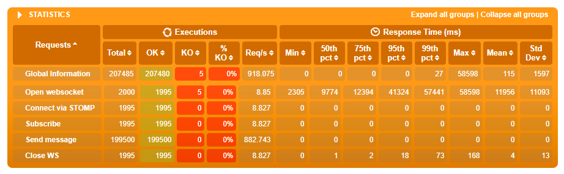
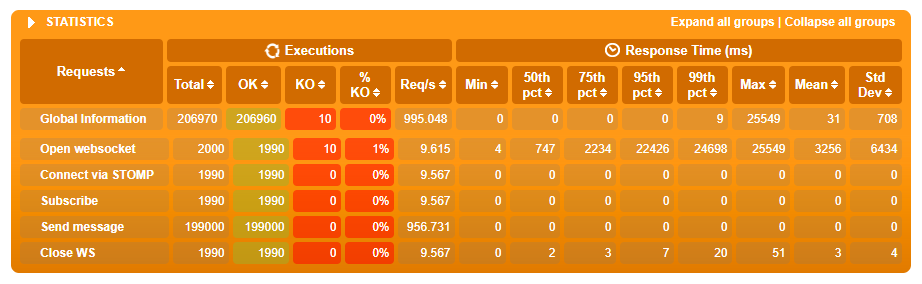
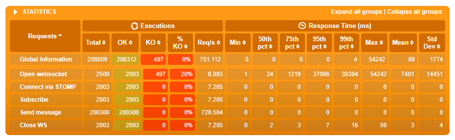
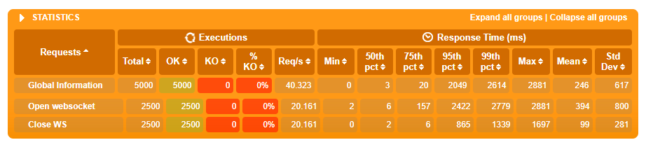

# Gatling + Websocket + STOMP

This is a sample application for perfomance testing websockets implementing [STOMP](http://stomp.github.io/) with [Gatling](https://gatling.io/docs/current/http/websocket/) and the [Gradle plugin](https://github.com/lkishalmi/gradle-gatling-plugin).

[Spring's sample application](https://spring.io/guides/gs/messaging-stomp-websocket/) is used as a test server.

## 更新日志
分支 spring-websocket-example 针对项目 [spring-websocket-example](https://github.com/mingt/spring-websocket-example) 进行压测，包括了以下更新：

* 新增加快国内访问的阿里云 repositoryies 镜像源
* 针对 spring-websocket-example 项目的压测接口调整
* 几个典型的结果报告及分析说明 [docs/gatling/reports](docs/gatling/reports)

### 结果报告及分析说明
压测场景大概配置如下，先连接 WS ，设定 STOMP 参数，订阅 /topic/greetings 频道，再发一条信息：

```
  val scenario1: ScenarioBuilder = scenario("WebSocket")
    .exec(ws("Open websocket")
      .open(s"/api/wsteaching/websocket")
    )
    .pause(1)
    .exec(ws("Connect via STOMP")
      .sendText("[\"CONNECT\\naccept-version:1.1,1.0\\nheart-beat:10000,10000\\n\\n\\u0000\"]")
    )
    .pause(1)
    .exec(ws("Subscribe")
      .sendText("[\"SUBSCRIBE\\nid:sub-0\\ndestination:/topic/greetings\\n\\n\\u0000\"]")
    )
    .pause(1)
    .repeat(100, "i") { // 每个用户持续发 100 条信息，间隔 1 秒
      exec(ws("Send message")
        .sendText("[\"SEND\\ndestination:/app/hello\\ncontent-length:15\\n\\n{\\\"name\\\":\\\"Sepp\\\"}\\u0000\"]")
      ).pause(1)
    }
    .pause(60) // 等待一段时间后主动关闭连接。注意有没有主动 heartbeat 心跳的情况，若没，Spring Websocket 默认 15 秒可能就已断开连接
    .exec(ws("Close WS").close)

  setUp(scenario1.inject(
    rampUsers(2000) over (20)
    // , nothingFor(40)
    // , atOnceUsers(500)
  ).protocols(httpConfig))
```

以下几个测试，测试请求都相同，模拟用户访问场景不同；在开发日常 Windows PC 机器单机测试，即发起测试和受测试未独立部署、结果性能数据并不代表真实线上服务器性能。通过对比，同时说明压测一般要注意哪些地方，等等：

1. **stompsimulation-1598886866023-atOnce2000** 仅 atOnceUsers(2000) ，模拟 2000 用户即时并发请求。 WS 服务端应用和 Gatling 都输出 stdout 日志。

2. **stompsimulation-1598927479531-atOnce2000-no-stdout** 仅 atOnceUsers(2000) ，模拟 2000 用户即时并发请求。但两者都不输出 stdout 日志。

3. **stompsimulation-1598959077098-ramp2000-20s-no-stdout** 改即时并发 2000 用户为 20 秒内渐进增加， rampUsers(2000) over (20) ，也不输出日志。

4. **stompsimulation-1599008728771-ramp2000-20s-atOnce500-no-stdout** 在 (3) 的基础模拟 40 秒后同时 500 新增用户并发，可组合测试。

5. **stompsimulation-1599028683767-ramp2000-20s-atOnce500-only-connect** 测试仅 WS 连接的情况。


结论：

* 从结果看到：
    - （1）结果 1、2、3 的请求响应时间依次更好。结果 2 比 1 有一倍多的改善，说明单机测试、日志输出对结果有很大的影响，所以建议应该采取一些措施使压测结果更接近生产环境，更有意义，包括不限于：把发起测试和受测试应用分开部署、受测试应用使用生产服的日志级别（例如至少为 warn ）、 Gatling 同时指定较高的级别，等等。
    - （2）结果 1 和 2 都有 failed 数量，响应延时 95 线不理想，所以应该判断为未通过的测试，意味着按当前的部署，此业务 2000 用户并发未能满足正常访问要求，出现连接失败的情况。结果 3 因为渐进增加用户，相当于每秒增加 2000 / 20 = 100 用户并发逐渐加强，连接响应 99 线在 3 秒左右，勉强可用。
    - （3）可以看到，基于 Spring Websocket + Stomp 的实现，连接 Open websocket 的耗时非常重，应该着重优化。同时结果 5 显示了仅压测 Open websocket 的结果，它显示若去掉其他如发信息请求，连接会有改善，但整体仍不够理想，再次验证这个实现的连接部分值得优化。
    - （4）看到结果里  Connect via STOMP, Subscribe, Send message 的请求响应时间都为零，可能系 Gatling 对 Stomp 协议的实现未够完善或者对应的配置未配置好，这点待确认。
* 待补充一个线上生产服的压测参考结果。
* 这里说明一下 WebSocket 选型的一些考虑。
    - **确定需求，从可选方案里基本确定方向。** 当前项目的需求是在线课堂的多端互动，特点有：用户量大，并发需求高，双向互动（例如从服务器推送指令到终端），互联网在线。根据这些特点，可以筛掉基于 HTTP (单向，短连接)、蓝牙（短程）、局域网（范围限制）等方案，而 WebSocket 支持长连接和双向通信的特点对于非常合适当前需求，这样，选型考虑的方向接着移到下一步，性能及其他方面。
    - **了解业界主流情况。见参考文档。** 这个业务场景和（消息）推送系统有近似，例如都有服务器和大量终端交互，所以考虑推送系统有不错的参考价值。与推送类似的业务技术通常需要考虑：充分挖掘单机性能，集群部署，高并发，高吞吐。
        - 按开发语言或组件，天生支持并发的 Go 语言有大量引用、成熟的实现和应用; 建立在 Java NIO（非阻塞 IO） 上的 Netty 异步、事件驱动网络框架被不少大公司（Apple, Alibaba）、大项目（Finagle, Dubbo, RocketMq）、甚至底层核心项目广泛应用；同样基于事件驱动、非阻塞式 I/O 模型的 Node.js ，轻量又高效，也有不少使用； Spring 的生态以提供一整套的关联解决方案著称， Spring WebSocket 是其中之一，它满足 Spring 生态的标准，如符合生产上线要求，足够稳定，尽管可能配置复杂，性能考虑非首位。一些行业使用：

            > （2015年）360 用 Go 实现的消息推送系统，下面是他们的数据：目前 360 消息推送系统服务于 50+ 内部产品，万款开发平台 App ，实时长连接数亿量级，日独数十亿量级， 1 分钟内可以实现亿量级广播，日下发峰值百亿量级， 400 台物理机， 3000 多个实例分布在 9 个独立集群中，每个集群跨国内外近 10 个IDC。（可以估算单机或实例容量：连接数亿量级，取 5 亿，除以 400 ，单机约 125 万，达到百万级别。）

        - 以上框架都能实现或支持 WebSocket 协议。

    - **原则一，符合项目或业务当前需求的特点和定位。** 当前在线课堂要求上线时间为一到二个月，暂属于前期基本功能上线验证阶段，当然也非常重要。这样，如果沿用团队已有技术积累的语言和环境会有较大的优势：当前团队大部分业务都搭建在 Spring Cloud 微服务上，所以，可以非常快速完成 Spring WebSocket 的集成和使用，从而开发人员能尽快地切入业务，把焦点放在业务开发上。
    - **原则二，遵循快速迭代，为未来预估容量。** 考察待选方案： Spring WebSocket 封装为模块纳入微服务框架，直接支持快速水平扩展；同时确定它可配置外部 Message Broker 如 RabbitMq 等，支持集群部署。所以，短中期它的扩展性能满足生产上线要求，这样就可以先实现最小化功能上线，之后逐步迭代。再结合压力测试等确定有关容量的技术参数，同时结合业务发展预估，最后和以上方案重新比较，就能指导下一阶段的开发需求。

## 参考文档

* [使用四种框架分别实现百万websocket常连接的服务器](https://colobu.com/2015/05/22/implement-C1000K-servers-by-spray-netty-undertow-and-node-js)
* [七种WebSocket框架的性能比较](https://colobu.com/2015/07/14/performance-comparison-of-7-websocket-frameworks)
* [构建C1000K的服务器(1) – 基础](http://www.ideawu.net/blog/archives/740.html)
* [基于Netty实现海量接入的推送服务技术要点](http://www.52im.net/thread-166-1-1.html)
